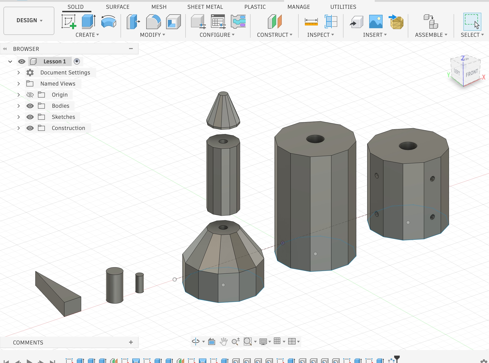

## Fusion 360 — Rocket Design

### Overview

This week, I used Fusion 360 to model a rocket made up of several individual components. I started with sketches based on hexagonal geometry and used **Extrude** to turn the profiles into 3D forms. For the tapered sections, I created sketches at different heights using **Offset Plane** and connected the profiles with **Loft**. I used the **Hole** feature to create precise openings in the components, and **Circular Pattern** to repeat features evenly around the body.

### Tools Used

`Sketch` · `Polygon` · `Extrude` · `Offset Plane` · `Loft` · `Hole` · `Circular Pattern`

### Challenges

One of the main challenges was understanding how different features depend on the geometry created before them. Working with Offset Planes and Loft required me to think about where each profile needed to be placed, while features such as Hole and Circular Pattern required careful selection and positioning.

### What I Learned

This project helped me understand how a complex 3D object can be built from relatively simple sketches and features. I also became more comfortable combining different Fusion 360 tools instead of treating each tool separately.